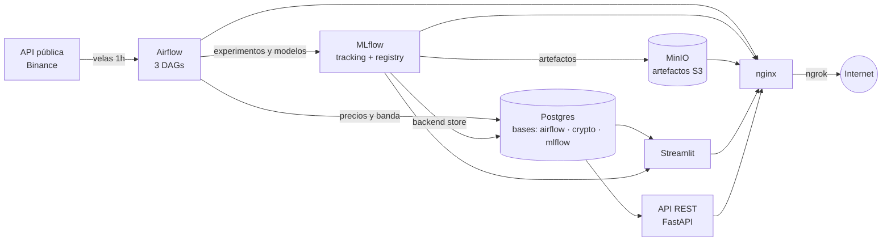
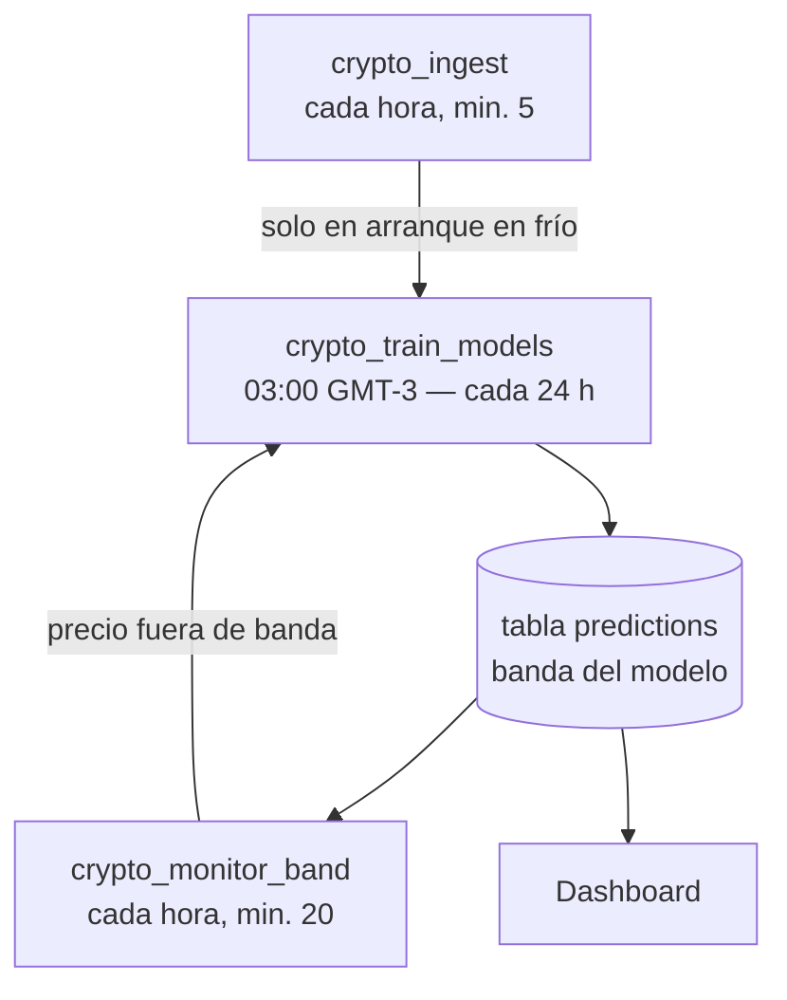

# Crypto MLOps — Forecast de precios de criptomonedas

Trabajo práctico final de la materia **Operaciones de Aprendizaje de Máquina** (CEIA — FIUBA).

Pipeline MLOps end-to-end, completamente containerizado, que ingesta velas horarias de Binance, entrena modelos Prophet por activo, los versiona y promueve en MLflow, monitorea en producción y expone los resultados en un dashboard.

# Docentes y Autores del Proyecto

## Docentes:
 - Facundo Adrián Lucianna

## Autores

- Juan Sebastián Bonals — jsbonals@gmail.com
- Federico Santiago Fontanari — federicofontanari@gmail.com
- Jose Andres Montes de Oca — amontesdeoca1982@gmail.com

---

## Objetivo

El foco del trabajo es el ciclo de vida completo: ingesta reproducible, orquestación, tracking de experimentos, registro y promoción de modelos, almacenamiento de artefactos, monitoreo, reentrenamiento automático y visualización. Por eso el modelo elegido es [Prophet](https://facebook.github.io/prophet/) de Meta, que resuelve series temporales univariadas con poco esfuerzo y devuelve intervalos de confianza.

Activos seguidos: **BTC/USDT, ETH/USDT y SOL/USDT**, con granularidad **horaria**.

## Arquitectura



Todo corre con `docker compose` y se publica a internet con **nginx** como proxy inverso (un único puerto 80 para las cuatro UIs) y **ngrok** como túnel.

### Servicios

| Servicio | Rol |
|---|---|
| `postgres` | Metadata de Airflow, backend store de MLflow y base `crypto` con precios y predicciones |
| `minio` | Almacenamiento S3-compatible de artefactos de MLflow (modelos serializados) |
| `minio-init` | Job efímero que crea el bucket |
| `mlflow` | Servidor de tracking + Model Registry |
| `airflow-init` | Migra la base y crea el usuario admin |
| `airflow-webserver` | UI de Airflow |
| `airflow-scheduler` | Ejecuta los DAGs (`LocalExecutor`) |
| `streamlit` | Dashboard de precios, forecast y estado de los modelos |
| `api` | API REST (FastAPI) que sirve las predicciones en JSON |
| `nginx` | Proxy inverso: unifica los accesos bajo un solo host |

### Estructura del repositorio

```
crypto-mlops/
├── docker-compose.yml      # stack completo
├── .env                    # credenciales y parámetros
├── airflow/
│   ├── Dockerfile
│   ├── requirements.txt
│   └── dags/
│       ├── dag_ingest.py       # crypto_ingest
│       ├── dag_train_daily.py  # crypto_train_models
│       └── dag_monitor_band.py # crypto_monitor_band
├── shared/common/          # módulo compartido (única fuente de verdad)
│   ├── config.py               # símbolos, ventanas, zona horaria, nombres de MLflow
│   ├── binance.py              # cliente de la API pública
│   ├── db.py                   # lectura/escritura en Postgres
│   └── training.py             # Prophet + MLflow
├── mlflow/Dockerfile
├── streamlit/{app.py, Dockerfile, requirements.txt}
├── api/{main.py, Dockerfile, requirements.txt}   # API REST
├── nginx/{nginx.conf, Dockerfile}
└── postgres/init.sql       # crea las bases y las tablas
```

`shared/common/` se monta por volumen en **Airflow** (`/opt/airflow/dags/common`), **Streamlit** (`/app/common`) y **la API** (`/app/common`). Así la lista de símbolos, la conexión a Postgres y los nombres de MLflow están definidos en un solo lugar: agregar un activo es editar una línea de `config.py`.

## Zona horaria

Todo el proyecto trabaja en **GMT-3** (`America/Argentina/Buenos_Aires`): los schedules de los DAGs, la UI de Airflow y las fechas del dashboard. En Postgres los timestamps se guardan en UTC (`TIMESTAMPTZ`) y la conversión se hace solo al mostrarlos.

Se define en dos lugares: `AIRFLOW__CORE__DEFAULT_TIMEZONE` / `AIRFLOW__WEBSERVER__DEFAULT_UI_TIMEZONE` en `docker-compose.yml` (schedules y UI de Airflow) y `LOCAL_TZ` en `shared/common/config.py` (todo lo que imprimen los DAGs y muestra Streamlit). Argentina no tiene horario de verano, así que `LOCAL_TZ` es un offset fijo de −3 y no depende de que la imagen traiga `tzdata`.

## Flujo de datos



### DAGs

**`crypto_ingest`** — cada hora en el minuto 5, cuando la vela anterior ya cerró.

Una única regla por símbolo: arranca en `MAX(open_time) + 1h` de la tabla `prices` y, si no hay datos, `HISTORY_YEARS` años atrás. La API de Binance devuelve como máximo 1000 velas por request, así que el cliente pagina automáticamente hasta el presente y descarta la vela todavía abierta. La escritura es idempotente (`ON CONFLICT DO UPDATE`), por lo que reintentos y solapes son inocuos. Después poda la ventana rodante, y **solo en el arranque en frío** dispara el primer entrenamiento.

**`crypto_train_models`** — diario a las 03:00 GMT-3.

Entrena un Prophet por símbolo con **toda** la ventana de entrenamiento, lo registra como una versión nueva en el Model Registry y le asigna el alias `production`. Después persiste la banda del modelo en la tabla `predictions` y borra la de las versiones anteriores para ahorrar espacio. De todas formas, el modelo queda persistido, por lo que es recuperable si se desea.

Se entrena con `TRAIN_DAYS` = **365 días** de velas horarias (8.760 observaciones), **no** con los 5 años que hay en la base: el histórico solo se guarda.

**Ponderación por antigüedad.** Dentro de ese año las horas recientes pesan más que las viejas. Prophet no acepta pesos por observación, así que se implementan **repitiendo filas**: repetir una fila N veces equivale a darle peso N en la verosimilitud. El peso arranca en `MAX_SAMPLE_WEIGHT` para la última hora y se divide a la mitad cada `WEIGHT_HALF_LIFE_DAYS`, con piso en 1.

Con los defaults (`MAX_SAMPLE_WEIGHT=3`, `WEIGHT_HALF_LIFE_DAYS=120`):

| Antigüedad | Peso |
|---|---|
| 0 – 32 días | 3 |
| 32 – 120 días | 2 |
| > 120 días | 1 |

Las 8.760 velas se convierten en ~12.400 filas de ajuste. El modelo ve el año entero —así el trend y la estacionalidad semanal se estiman sobre historia suficiente— pero el nivel reciente manda.

Acepta en `dag_run.conf`:
- `symbols`: lista de símbolos a reentrenar (por defecto, todos).
- `trigger_reason`: se guarda como parámetro del run y como tag de la versión.

**`crypto_monitor_band`** — cada hora en el minuto 20 (15 minutos después de la ingesta).

Es la **señal de drift** del proyecto. Compara el precio de la última vela cerrada con la banda `[yhat_lower, yhat_upper]` del modelo en producción: si quedó fuera, dispara `crypto_train_models` pasando **solo esos símbolos**. Un cooldown de `RETRAIN_COOLDOWN_HOURS` evita reentrenar en cadena mientras el modelo recién promovido todavía es nuevo.

### Hiperparámetros de Prophet

Están centralizados en `PROPHET_PARAMS` (`shared/common/config.py`) y se loguean como parámetros de cada run de MLflow. Se usan los **defaults de Prophet** salvo algunas excepciones:

| Parámetro | Default | Usado | Por qué |
|---|---|---|---|
| `interval_width` | `0.8` | **`0.95`** | Se establece una banda de control del 95% arbitrariamente |
| `changepoint_prior_scale` | `0.05` | `0.05` | Subirlo (p. ej. a `0.5`) da más seguimiento de corto plazo, pero abre la banda enormemente con el horizonte: la incertidumbre futura se simula a partir de la magnitud de los changepoints observados |
| `yearly_seasonality` | `auto` | `False` | Con 365 días hay un solo ciclo, no alcanza para estimarla; explícito para que quede registrado en MLflow |

Cada run registra, además de MAPE y RMSE, dos métricas de diagnóstico: `band_width_pct` (ancho medio de la banda como % del precio) y `coverage` (% de horas dentro de la banda). Todas se calculan sobre la propia ventana de entrenamiento y son informativas.

### Política de reentrenamiento

**No hay champion/challenger** Cada corrida entrena con todos los datos disponibles y promueve la versión nueva a `production`. El control no pasa por comparar métricas entre modelos sino por **cuándo** se reentrena:

1. **Cada 24 h**, por schedule.
2. **Cuando el precio actual se sale de la banda de control**, detectado por el monitor cada hora.

La verificación real del modelo la hace el propio monitor: cada hora llega una vela que no existía cuando se entrenó y se compara contra la banda. MAPE y RMSE se registran en MLflow para auditar la evolución entre versiones, pero no deciden nada.

### Retención vs. entrenamiento

Son dos ventanas distintas y conviene no confundirlas:

| Ventana | Parámetro | Valor | Para qué |
|---|---|---|---|
| Retención en la base | `HISTORY_YEARS` | 5 años | Solo para graficar. Ocupa ~15 MB en total |
| Entrenamiento | `TRAIN_DAYS` | 365 días | Lo único que ve el modelo |
| Banda persistida hacia atrás | `BACKCAST_DAYS` | 90 días | Recortada a `TRAIN_DAYS` |
| Forecast persistido | `FORECAST_DAYS` | 7 días | Más allá pierde porder predictivo el modelo |

El histórico profundo existe por si se quiere que el dashboard lo muestre y para demostrar el backfill con ventana rodante; el modelo nunca lo usa.

## Modelo de datos

Base `crypto` en Postgres (`postgres/init.sql`):

**`prices`** — velas horarias de Binance. PK `(symbol, open_time)`.

| Columna | Tipo |
|---|---|
| `symbol` | `TEXT` |
| `open_time` | `TIMESTAMPTZ` |
| `open`, `high`, `low`, `close`, `volume` | `DOUBLE PRECISION` |

**`predictions`** — banda del modelo en producción. PK `(symbol, ds, model_version)`.

| Columna | Tipo |
|---|---|
| `symbol` | `TEXT` |
| `ds` | `TIMESTAMPTZ` |
| `yhat`, `yhat_lower`, `yhat_upper` | `DOUBLE PRECISION` |
| `model_version` | `INT` (versión del Model Registry) |
| `predicted_at` | `TIMESTAMPTZ` |

Cada promoción escribe la banda desde `BACKCAST_DAYS` hacia atrás hasta `FORECAST_DAYS` hacia adelante (~2.300 filas por símbolo). El tramo hacia atrás es el que permite dibujar el intervalo sobre la historia en el dashboard y comparar predicho contra real.

## Dashboard

Todas las fechas se muestran en **GMT-3**.

- **Precio y forecast**: histórico en **velas japonesas**, forecast en **línea punteada** y **banda del 95% sobre historia y futuro**, con una línea vertical marcando el presente. Selector de granularidad (1 h / 4 h / 1 D, con default automático según el rango).

  El gráfico está acotado a `BACKCAST_DAYS` (90) hacia atrás y `FORECAST_DAYS` (7) hacia adelante, **por diseño**: nunca se dibuja una vela que no tenga su intervalo del 95% alrededor. El eje Y queda anclado a las velas y la banda puede excederlas como máximo un 25% del rango visible antes de recortarse — sin ese tope, el cono a 7 días supera el máximo y el mínimo históricos y aplasta las velas.
- **Diagnóstico**: error del modelo hora a hora, cobertura de la banda y listado de las horas fuera de banda.
- **Modelos**: inventario del Model Registry con versión, alias, MAPE, RMSE y el motivo de cada reentrenamiento.


## API REST

Servicio **FastAPI** (`api/main.py`) que devuelve las predicciones en JSON. Es una capa de **solo lectura sobre la tabla `predictions`**: el forecast ya lo calculó y persistió `crypto_train_models` en la última promoción, así que la API no carga Prophet ni consulta MLflow. Comparte `shared/common/` con los DAGs y el dashboard.

| Endpoint | Devuelve |
|---|---|
| `GET /api/health` | Estado del servicio y de la conexión a Postgres |
| `GET /api/symbols` | Símbolos seguidos y parámetros del forecast |
| `GET /api/predictions/{symbol}?hours=24` | Banda hora a hora desde ahora hacia adelante (`hours` entre 1 y `FORECAST_DAYS`×24) |
| `GET /api/status/{symbol}` | Último precio observado contra la banda, con el flag `dentro_de_banda` |

```bash
curl http://localhost/api/predictions/BTCUSDT?hours=3
```

```json
{
  "symbol": "BTCUSDT",
  "model_version": 12,
  "interval_width": 0.95,
  "timezone": "GMT-3",
  "count": 3,
  "predictions": [
    {"ds": "2026-08-02T15:00:00-03:00", "yhat": 61234.5, "yhat_lower": 59180.2, "yhat_upper": 63290.7},
    {"ds": "2026-08-02T16:00:00-03:00", "yhat": 61255.1, "yhat_lower": 59102.8, "yhat_upper": 63410.4},
    {"ds": "2026-08-02T17:00:00-03:00", "yhat": 61271.9, "yhat_lower": 59034.6, "yhat_upper": 63515.2}
  ]
}
```

```bash
curl http://localhost/api/status/ETHUSDT
```

```json
{
  "symbol": "ETHUSDT",
  "open_time": "2026-08-02T14:00:00-03:00",
  "price": 3120.44,
  "yhat_lower": 2998.10,
  "yhat_upper": 3241.87,
  "dentro_de_banda": true,
  "model_version": 12,
  "interval_width": 0.95,
  "timezone": "GMT-3"
}
```

Un símbolo que no está en `SYMBOLS` devuelve **404** con la lista de los disponibles; si todavía no se entrenó ningún modelo, **404** indicando qué DAG correr. También queda publicada en el puerto directo `:8000`.

## Puesta en marcha

### Requisitos

- Docker y Docker Compose.
- Salida a internet hacia `api.binance.com`.

### Arranque

```bash
git clone <repo> && cd crypto-mlops
docker compose up -d --build
```

En el primer arranque la tabla está vacía, así que `crypto_ingest` descarga 5 años de velas horarias por activo (~43.000 por símbolo, unos 44 requests paginados) y encadena el primer entrenamiento. Los DAGs quedan despausados automáticamente.

### Accesos

| UI | URL |
|---|---|
| Streamlit | `http://localhost/` |
| Airflow | `http://localhost/airflow/` |
| MLflow | `http://localhost/mlflow/` |
| MinIO Console | `http://localhost/minio/` |
| API (Swagger) | `http://localhost/api/docs` |

### Exposición a internet

nginx publica todas las UIs y la API en el puerto 80. Para llegar desde afuera de la VM:

```bash
ngrok http 80
# o, con un dominio reservado:
ngrok http --url=<tu-dominio>.ngrok-free.dev 80
```

**Importante:** Airflow y la consola de MinIO no funcionan bajo un subpath si no saben cuál es su URL pública. Antes de levantar el stack hay que poner el dominio en `PUBLIC_BASE_URL` (`.env`) y reiniciar:

```env
PUBLIC_BASE_URL=https://<tu-dominio>.ngrok-free.dev
```


## Variables de entorno

Archivo `.env` en la raíz:

```env
POSTGRES_USER=admin
POSTGRES_PASSWORD=admin123
POSTGRES_DB=airflow
MINIO_ROOT_USER=admin
MINIO_ROOT_PASSWORD=admin123
MLFLOW_BUCKET=mlflow
AIRFLOW_ADMIN_USER=admin
AIRFLOW_ADMIN_PASSWORD=admin123
BINANCE_BASE_URL=https://api.binance.com
HISTORY_YEARS=5
```

> ⚠️ El `.env` está versionado con credenciales de desarrollo para facilitar la corrección del trabajo. **No usar estos valores en un entorno real.**

Opcionales, con default en `shared/common/config.py`:

| Variable | Default | Qué hace |
|---|---|---|
| `TRAIN_DAYS` | `365` | Ventana de entrenamiento, independiente de lo que se guarda en la base |
| `MAX_SAMPLE_WEIGHT` | `3` | Peso de la hora más reciente en el ajuste |
| `WEIGHT_HALF_LIFE_DAYS` | `120` | Cada cuántos días se divide a la mitad ese peso |
| `FORECAST_DAYS` | `7` | Horizonte del forecast persistido |
| `BACKCAST_DAYS` | `90` | Cuánta historia hacia atrás se persiste con banda (se recorta a `TRAIN_DAYS`) |
| `RETRAIN_COOLDOWN_HOURS` | `3` | Tiempo mínimo entre reentrenamientos por salida de banda |

`CRYPTO_DB_URI`, `MLFLOW_TRACKING_URI`, `MLFLOW_S3_ENDPOINT_URL` y las credenciales AWS/MinIO las inyecta `docker-compose.yml`; no hace falta definirlas a mano.


## Stack

| Componente | Versión |
|---|---|
| Apache Airflow | 2.10.4 (Python 3.11) |
| MLflow | 2.17.2 |
| Prophet | 1.1.6 |
| Postgres | 16 |
| MinIO | latest |
| Streamlit | 1.41.1 |
| Plotly | 5.24.1 |
| FastAPI | 0.115.6 |
